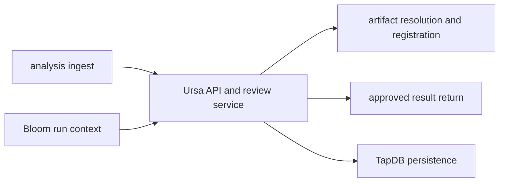

[](https://github.com/Daylily-Informatics/daylily-ursa/releases)
[](https://github.com/Daylily-Informatics/daylily-ursa/tags)
[](https://github.com/Daylily-Informatics/daylily-ursa/actions/workflows/ci.yml)

# daylily-ursa

Daylily Ursa is the analysis execution, review, artifact-linking, and result-return service. It sits downstream of wet-lab execution and upstream of customer-visible delivery, coordinating analysis ingest, review state, Dewey artifact linkage, and Atlas return.

Ursa owns:
- analysis ingest records linked to sequencing context
- analysis and review state
- Dewey artifact-link and registration flows for analysis inputs and outputs
- Atlas result return after approval

Ursa does not own:
- customer portal routes
- storage policy authority
- file or file-set identity
- generic shared DB or auth lifecycle

## Component View



## Prerequisites

- Python 3.10+
- local PostgreSQL/TapDB-compatible runtime
- API keys and base URLs if you want live Bloom, Dewey, or Atlas integration
- Playwright browser binaries for E2E flows

## Getting Started

### Quickstart

```bash
source ./activate <deploy-name>
ursa config init
ursa db build --target local
ursa server start --port 8913
```

`ursa server start` uses the shared TLS resolver by default. Pass `--no-ssl` for HTTP-only
local testing, or `--cert` and `--key` to override the deployment-scoped cert pair.

### CLI Examples

Examples:

```bash
ursa config init
ursa db build --target local
ursa server start --port 8913 --foreground
ursa monitor start --config config/workset-monitor-config.yaml --foreground
daylily-ec samples stage samples.tsv --profile default --region us-west-2 --reference-bucket s3://bucket/ --config-dir worksets/ws-001
```

Current live caveats from the April 7, 2026 local walkthrough:

- the missing-config hint from `ursa env validate` now says `ursa config init`
- GUI startup requires the Cognito values to exist in the YAML config itself; the current server preflight does not accept those fields from shell env overrides alone
- populate these YAML fields before starting the GUI path:
  `cognito_user_pool_id`, `cognito_app_client_id`, `cognito_region`, `cognito_domain`, `cognito_callback_url`, `cognito_logout_url`
- `ursa config edit` is the repo-owned path for filling those fields

Validation:

```bash
pytest -q
```

## Architecture

### Technology

- FastAPI + Jinja2-facing service/UI pieces
- Typer-based `ursa` CLI
- TapDB for persistence
- HTTP integration clients for Bloom, Dewey, and Atlas

### Core Object Model

Ursa centers on:

- analyses and ingest payloads
- review state and approval
- input references to storage URIs or Dewey artifacts
- output artifacts registered or resolved through Dewey
- result-return requests back into Atlas

### Runtime Shape

- app factory: `daylib_ursa.workset_api:create_app`
- CLI: `ursa`
- alternate entrypoint: `daylily-workset-api`

### Request Lifecycle

1. ingest analysis input and sequencing context
2. resolve upstream run context as needed
3. attach outputs and artifact links
4. review and approve
5. return approved results to Atlas

## Cost Estimates

Approximate only.

- Local development: workstation plus local database.
- Shared sandbox: usually a service-level slice of the wider Dayhoff environment.
- Production-like use grows with retained analysis metadata, integration traffic, and uptime requirements rather than unusual Ursa-specific infrastructure.

## Development Notes

- Canonical local entry path: `source ./activate <deploy-name>`
- Use `ursa ...` for Ursa-owned runtime operations
- Use `tapdb ...` only where Ursa explicitly delegates shared DB/runtime lifecycle
- Use `daycog ...` only where Ursa explicitly delegates shared auth lifecycle

Useful checks:

```bash
source ./activate <deploy-name>
ursa --help
ursa --json version
ursa server --help
pytest -q
```

## Sandboxing

- Safe: docs work, tests, `ursa --help`, and local-only runtime work
- Local-stateful: config init and local DB bootstrap paths
- Requires extra care: live Atlas/Bloom/Dewey integrations and any deployed environment changes

## Current Docs

- [Docs index](docs/README.md)
- [Ursa-Atlas return contract](docs/ursa_atlas_return_contract.md)

## References

- [FastAPI](https://fastapi.tiangolo.com/)
- [TapDB](https://github.com/Daylily-Informatics/daylily-tapdb)
- [Dewey](https://github.com/Daylily-Informatics/dewey)
