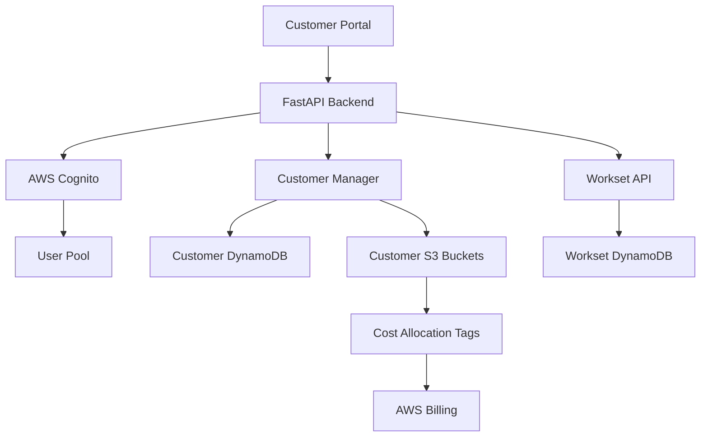

# Customer Portal and Multi-Tenant Support

This document describes the customer portal and multi-tenant capabilities for the Daylily workset monitoring system.

## Overview

The customer portal provides a self-service interface for customers to:
- Onboard and manage their accounts
- Submit and monitor worksets
- Track resource usage and costs
- Generate workset configurations
- Upload FASTQ files

## Architecture



## Features

### 1. Customer Onboarding

Automatically provision resources for new customers:
- Unique customer ID generation
- Dedicated S3 bucket with versioning
- Cost allocation tags for billing
- Lifecycle policies for cost management
- DynamoDB record for tracking

### 2. Authentication with AWS Cognito

Secure multi-tenant access using AWS Cognito:
- User pool for customer users
- JWT token-based authentication
- Email-based usernames
- Custom attributes (customer_id)
- Password policies

### 3. Resource Quotas

Per-customer resource limits:
- Max concurrent worksets
- Max storage (GB)
- Billing account association
- Cost center tracking

### 4. YAML Generator

Web-based form to generate `daylily_work.yaml`:
- Sample configuration
- Reference genome selection
- Pipeline type selection
- Priority and retry settings
- Resource estimation

## Setup

### 1. Create Customer Table

```python
from daylib.workset_customer import CustomerManager

manager = CustomerManager(
    region="us-west-2",
    bucket_prefix="daylily-customer",
)

manager.create_customer_table_if_not_exists()
```

### 2. Setup Cognito Authentication

```python

from daylib.workset_auth import CognitoAuth

# This creates both the user pool and app client automatically
auth = CognitoAuth.create_with_new_pool(region="us-west-2")

print(f"Pool ID: {auth.user_pool_id}")
print(f"Client ID: {auth.app_client_id}")

```

### 3. Start API with Authentication

```python
from daylib.workset_api import create_app
from daylib.workset_state_db import WorksetStateDB
from daylib.workset_auth import CognitoAuth
from daylib.workset_customer import CustomerManager

# Initialize components
state_db = WorksetStateDB("daylily-worksets", "us-west-2")
cognito_auth = CognitoAuth(
    region="us-west-2",
    user_pool_id="us-west-2_XXXXXXXXX",
    app_client_id="XXXXXXXXXXXXXXXXXXXXXXXXXX",
)
customer_manager = CustomerManager(region="us-west-2")

# Create app with authentication enabled
app = create_app(
    state_db=state_db,
    cognito_auth=cognito_auth,
    customer_manager=customer_manager,
    enable_auth=True,
)
```

## API Endpoints

### Customer Management

#### Create Customer
```http
POST /customers
Content-Type: application/json

{
  "customer_name": "Acme Genomics",
  "email": "admin@acme.com",
  "max_concurrent_worksets": 10,
  "max_storage_gb": 5000,
  "billing_account_id": "BA-12345",
  "cost_center": "CC-GENOMICS"
}
```

Response:
```json
{
  "customer_id": "acme-genomics-a1b2c3d4",
  "customer_name": "Acme Genomics",
  "email": "admin@acme.com",
  "s3_bucket": "daylily-customer-acme-genomics-a1b2c3d4",
  "max_concurrent_worksets": 10,
  "max_storage_gb": 5000,
  "billing_account_id": "BA-12345",
  "cost_center": "CC-GENOMICS"
}
```

#### Get Customer Details
```http
GET /customers/{customer_id}
Authorization: Bearer <jwt_token>
```

#### List Customers
```http
GET /customers
Authorization: Bearer <jwt_token>
```

#### Get Customer Usage
```http
GET /customers/{customer_id}/usage
Authorization: Bearer <jwt_token>
```

Response:
```json
{
  "customer_id": "acme-genomics-a1b2c3d4",
  "storage_gb": 1234.56,
  "max_storage_gb": 5000,
  "storage_utilization_percent": 24.69
}
```

### YAML Generator

#### Generate daylily_work.yaml
```http
POST /worksets/generate-yaml
Content-Type: application/json

{
  "samples": [
    {
      "sample_id": "sample1",
      "fastq_r1": "sample1_R1.fq.gz",
      "fastq_r2": "sample1_R2.fq.gz",
      "coverage": 30
    }
  ],
  "reference_genome": "hg38",
  "pipeline": "germline",
  "priority": "normal",
  "max_retries": 3,
  "estimated_coverage": 30.0
}
```

Response:
```json
{
  "yaml_content": "samples:\n- sample_id: sample1\n  fastq_r1: sample1_R1.fq.gz\n...",
  "config": { ... }
}
```

## User Management

### Create Customer User

```python
from daylib.workset_auth import CognitoAuth

auth = CognitoAuth(
    region="us-west-2",
    user_pool_id="us-west-2_XXXXXXXXX",
    app_client_id="XXXXXXXXXXXXXXXXXXXXXXXXXX",
)

user = auth.create_customer_user(
    email="user@acme.com",
    customer_id="acme-genomics-a1b2c3d4",
    temporary_password="TempPass123!",
)
```

### Authenticate User

Users authenticate using AWS Cognito:

```bash
# Using AWS CLI
aws cognito-idp initiate-auth \
  --auth-flow USER_PASSWORD_AUTH \
  --client-id XXXXXXXXXXXXXXXXXXXXXXXXXX \
  --auth-parameters USERNAME=user@acme.com,PASSWORD=password123
```

### Use JWT Token

Include the JWT token in API requests:

```bash
curl -H "Authorization: Bearer <jwt_token>" \
  https://api.example.com/worksets
```

## Cost Allocation and Billing

### S3 Bucket Tags

Each customer bucket is tagged for cost allocation:

```python
{
    "Customer": "acme-genomics-a1b2c3d4",
    "ManagedBy": "daylily-workset-monitor",
    "Environment": "production",
    "CostCenter": "CC-GENOMICS"
}
```
 
### Lifecycle Policies

Automatic cost management:
- Delete old worksets after 90 days
- Transition results to Infrequent Access after 30 days

### Usage Tracking

Monitor customer usage:

```python
usage = customer_manager.get_customer_usage("acme-genomics-a1b2c3d4")
print(f"Storage: {usage['storage_gb']} GB")
print(f"Utilization: {usage['storage_utilization_percent']}%")
```

## Security Best Practices

1. **Enable MFA** for Cognito users
2. **Use HTTPS** for all API communication
3. **Rotate credentials** regularly
4. **Implement rate limiting** to prevent abuse
5. **Audit access logs** regularly
6. **Use least privilege** IAM policies
7. **Enable CloudTrail** for audit logging

## See Also

- [Authentication Setup](AUTHENTICATION_SETUP.md)
- [Billing Integration](BILLING_INTEGRATION.md)

