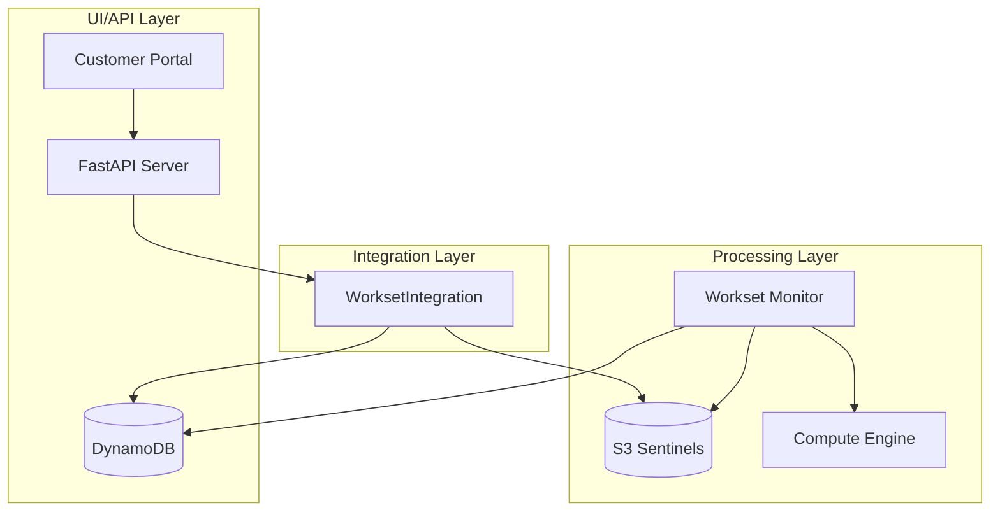
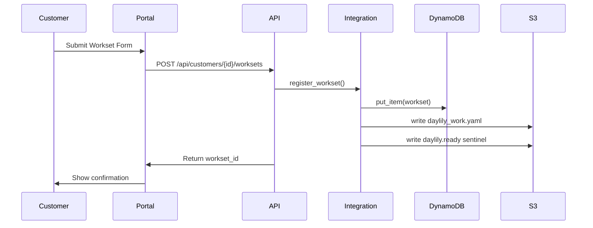
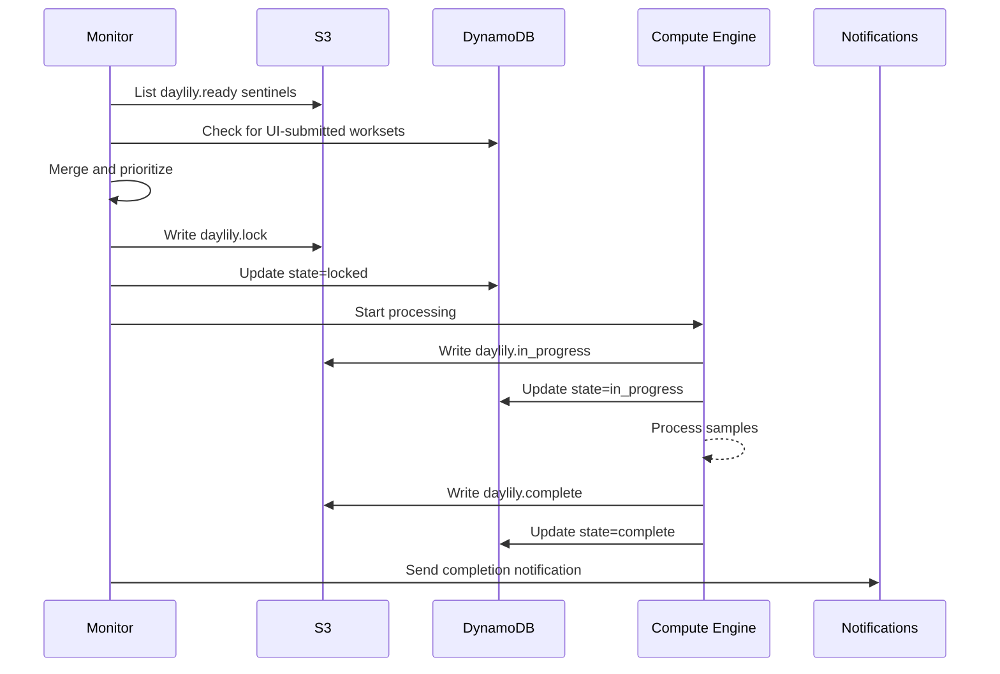

# Daylily Integration Guide

This guide explains how the UI/API layer integrates with the processing engine and how to deploy the complete system.

## Architecture Overview

The Daylily system consists of two main layers that must work together:

1. **UI/API Layer** - Customer portal, REST API, DynamoDB state management
2. **Processing Layer** - S3 sentinel-based workset monitor, compute engine



## Component Integration

### WorksetIntegration Module

The `daylib.workset_integration` module provides the bridge between systems:

```python
from daylib.workset_integration import WorksetIntegration
from daylib.workset_state_db import WorksetStateDB

# Initialize state database
state_db = WorksetStateDB(
    table_name="daylily-worksets",
    region="us-west-2",
)

# Create integration layer
integration = WorksetIntegration(
    state_db=state_db,
    bucket="daylily-worksets-bucket",
    prefix="worksets/",
    region="us-west-2",
)

# Register a workset (writes to both DynamoDB and S3)
integration.register_workset(
    workset_id="customer-ws-001",
    bucket="daylily-worksets-bucket",
    prefix="worksets/customer-ws-001/",
    priority="normal",
    metadata={
        "samples": [...],
        "reference_genome": "GRCh38",
    },
    write_s3=True,
    write_dynamodb=True,
)
```

### API Server Configuration

The API server automatically uses the integration layer when configured:

```python
from daylib.workset_api import create_app
from daylib.workset_state_db import WorksetStateDB

state_db = WorksetStateDB(table_name="daylily-worksets")

# Integration is automatically configured
app = create_app(
    state_db=state_db,
    s3_bucket="daylily-worksets-bucket",
    s3_prefix="worksets/",
)
```

### Workset Monitor Configuration

Enable DynamoDB integration in the workset monitor:

```bash
# Basic invocation with DynamoDB integration
daylily-workset-monitor \
    --bucket daylily-worksets-bucket \
    --prefix worksets/ \
    --dynamodb-table daylily-worksets \
    --dynamodb-region us-west-2

# Full integration with notifications
daylily-workset-monitor \
    --bucket daylily-worksets-bucket \
    --prefix worksets/ \
    --dynamodb-table daylily-worksets \
    --dynamodb-region us-west-2 \
    --sns-topic-arn arn:aws:sns:us-west-2:123456789:workset-notifications \
    --linear-api-key $LINEAR_API_KEY \
    --linear-team-id $LINEAR_TEAM_ID
```

## Deployment Options

### Option 1: Unified Deployment

Run API and monitor on the same instance:

```bash
# Start API server
python -m uvicorn daylib.workset_api:app \
    --host 0.0.0.0 \
    --port 8000

# Start monitor (separate process)
daylily-workset-monitor \
    --bucket $WORKSET_BUCKET \
    --dynamodb-table $WORKSET_TABLE \
    --poll-interval 60
```

### Option 2: Separated Deployment

**API Server (ECS/Fargate)**
```yaml
# ecs-task-definition.yaml
containerDefinitions:
  - name: daylily-api
    image: daylily/api:latest
    environment:
      - name: WORKSET_TABLE_NAME
        value: daylily-worksets
      - name: S3_BUCKET
        value: daylily-worksets-bucket
    portMappings:
      - containerPort: 8000
```

**Monitor (EC2/Lambda)**
```yaml
# monitor-config.yaml
bucket: daylily-worksets-bucket
prefix: worksets/
dynamodb_table: daylily-worksets
poll_interval: 60
sns_topic_arn: arn:aws:sns:us-west-2:123456789:notifications
```

## HTTPS Configuration

For production deployments, enable HTTPS:

```bash
# Generate self-signed certificate for testing
openssl req -x509 -newkey rsa:4096 \
    -keyout key.pem -out cert.pem \
    -days 365 -nodes \
    -subj "/CN=localhost"

# Run API with HTTPS
python examples/run_api_with_auth.py \
    --https \
    --port 8443 \
    --cert /etc/ssl/certs/server.pem \
    --key /etc/ssl/private/server-key.pem
```

For production, use certificates from AWS Certificate Manager or Let's Encrypt.

## Environment Variables

| Variable | Description | Default |
|----------|-------------|---------|
| `AWS_REGION` | AWS region | `us-west-2` |
| `WORKSET_TABLE_NAME` | DynamoDB table name | `daylily-worksets` |
| `S3_BUCKET` | S3 bucket for worksets | - |
| `S3_PREFIX` | S3 prefix for worksets | `worksets/` |
| `COGNITO_USER_POOL_ID` | Cognito User Pool ID | - |
| `COGNITO_APP_CLIENT_ID` | Cognito App Client ID | - |
| `SNS_TOPIC_ARN` | SNS topic for notifications | - |
| `LINEAR_API_KEY` | Linear API key | - |
| `LINEAR_TEAM_ID` | Linear team ID | - |

## Data Flow

### Workset Submission Flow



### Workset Processing Flow



## IAM Permissions

The integration requires these IAM permissions:

```json
{
    "Version": "2012-10-17",
    "Statement": [
        {
            "Effect": "Allow",
            "Action": [
                "dynamodb:GetItem",
                "dynamodb:PutItem",
                "dynamodb:UpdateItem",
                "dynamodb:Query",
                "dynamodb:Scan"
            ],
            "Resource": "arn:aws:dynamodb:*:*:table/daylily-worksets*"
        },
        {
            "Effect": "Allow",
            "Action": [
                "s3:GetObject",
                "s3:PutObject",
                "s3:DeleteObject",
                "s3:ListBucket"
            ],
            "Resource": [
                "arn:aws:s3:::daylily-worksets-bucket",
                "arn:aws:s3:::daylily-worksets-bucket/*"
            ]
        },
        {
            "Effect": "Allow",
            "Action": "sns:Publish",
            "Resource": "arn:aws:sns:*:*:workset-*"
        }
    ]
}
```

## Troubleshooting

### Worksets Not Being Discovered

1. Check DynamoDB table exists and has correct GSI
2. Verify S3 bucket permissions
3. Check monitor logs for discovery errors

```bash
# Enable debug logging
export DAYLILY_LOG_LEVEL=DEBUG
daylily-workset-monitor --bucket $BUCKET --dynamodb-table $TABLE
```

### State Sync Issues

If DynamoDB and S3 states diverge:

```python
from daylib.workset_integration import WorksetIntegration

integration = WorksetIntegration(...)

# Force sync from DynamoDB to S3
integration.sync_workset_to_s3("workset-id")

# Or sync all pending worksets
integration.sync_all_pending_to_s3()
```

### Cost Estimation Not Working

Ensure the `/api/estimate-cost` endpoint is reachable:

```bash
curl -X POST http://localhost:8001/api/estimate-cost \
    -H "Content-Type: application/json" \
    -d '{
        "pipeline_type": "germline",
        "reference_genome": "GRCh38",
        "sample_count": 5
    }'
```

## Related Documentation

- [ARCHITECTURE.md](ARCHITECTURE.md) - System architecture
- [AUTHENTICATION_SETUP.md](AUTHENTICATION_SETUP.md) - Cognito setup
- [CUSTOMER_PORTAL.md](CUSTOMER_PORTAL.md) - Portal deployment
- [WORKSET_MONITOR_README.md](WORKSET_MONITOR_README.md) - Monitor details

