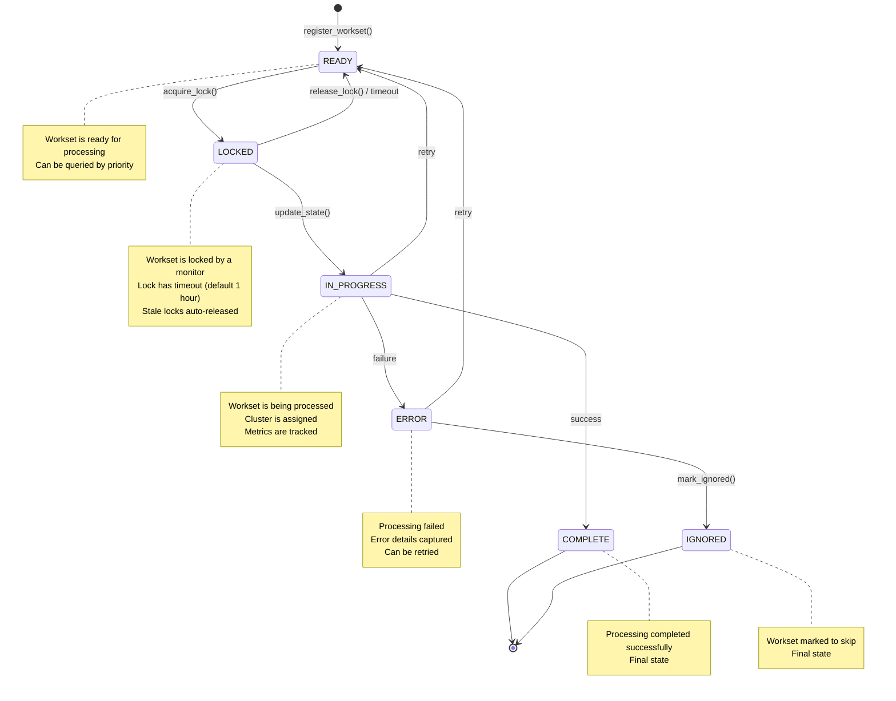
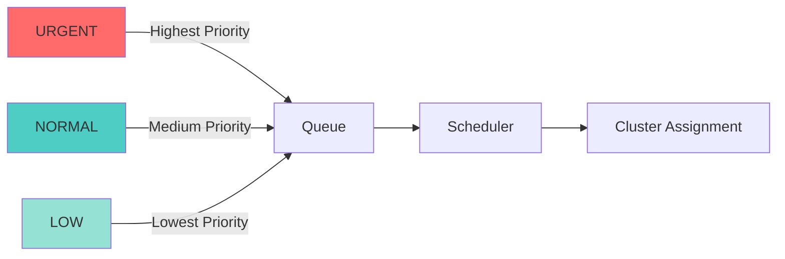
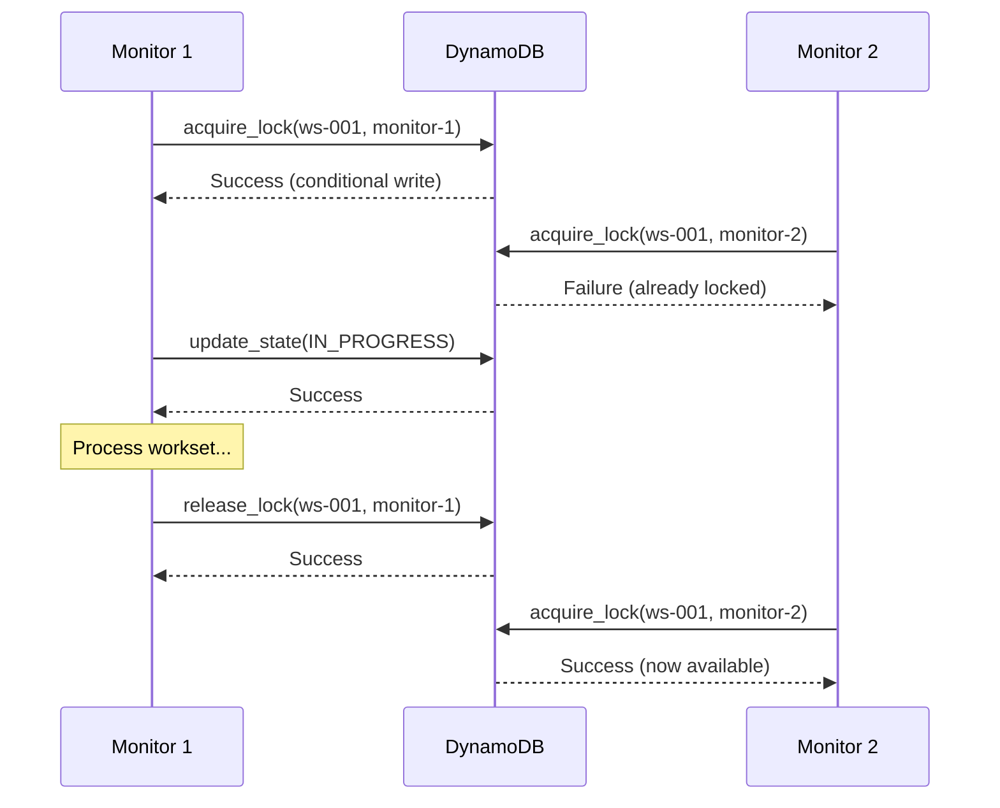
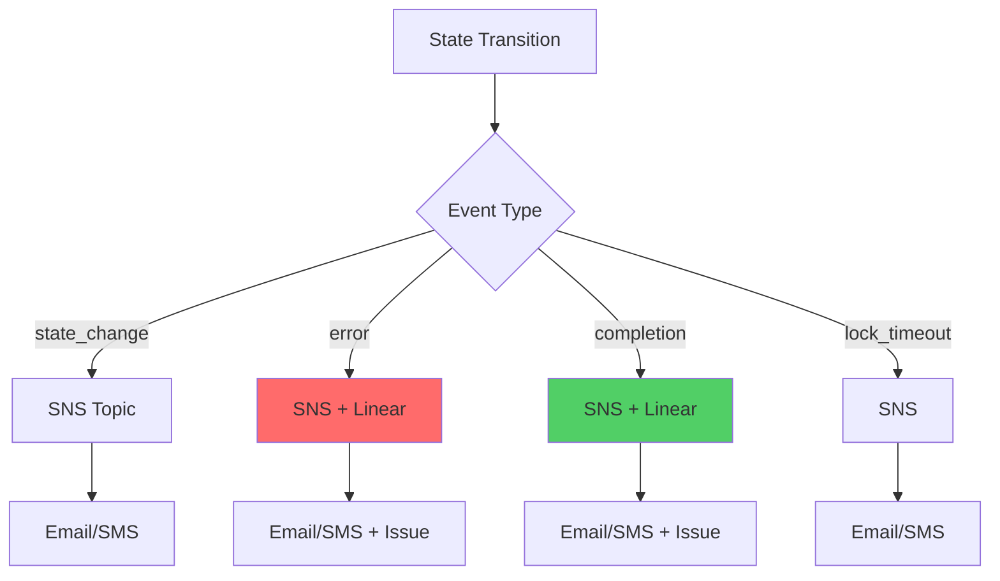

# Workset State Transition Diagram

This document visualizes the state transitions in the enhanced workset monitoring system.

## State Transition Flow



## State Descriptions

### READY
- **Description**: Workset is registered and ready for processing
- **Entry**: `register_workset()` or retry from ERROR/IN_PROGRESS
- **Exit**: Lock acquired by monitor
- **Queryable**: Yes, by priority (urgent > normal > low)
- **Notifications**: State change notification

### LOCKED
- **Description**: Workset is locked by a monitor instance
- **Entry**: `acquire_lock()` succeeds
- **Exit**: Lock released or timeout
- **Lock Timeout**: Configurable (default 1 hour)
- **Auto-Release**: Stale locks automatically released
- **Notifications**: Lock timeout notification

### IN_PROGRESS
- **Description**: Workset is actively being processed
- **Entry**: Monitor starts processing
- **Exit**: Success, failure, or retry
- **Tracking**: Cluster name, metrics, progress
- **Notifications**: State change notification

### COMPLETE
- **Description**: Processing completed successfully
- **Entry**: Successful pipeline completion
- **Exit**: None (final state)
- **Tracking**: Final metrics, cost, duration
- **Notifications**: Completion notification

### ERROR
- **Description**: Processing failed
- **Entry**: Pipeline failure or error
- **Exit**: Retry or mark as ignored
- **Tracking**: Error details, stack trace
- **Notifications**: Error notification (urgent)

### IGNORED
- **Description**: Workset marked to be skipped
- **Entry**: Manual intervention or policy
- **Exit**: None (final state)
- **Tracking**: Reason for ignoring
- **Notifications**: State change notification

## Priority Levels



### Priority Behavior

- **URGENT**: Processed first, regardless of cost
- **NORMAL**: Processed by cost efficiency within normal priority
- **LOW**: Processed last, optimized for lowest cost

## Lock Mechanism



## Audit Trail

Every state transition is recorded in the `state_history` attribute:

```json
{
  "state_history": [
    {
      "timestamp": "2024-01-15T10:00:00Z",
      "from_state": null,
      "to_state": "ready",
      "reason": "Workset registered",
      "actor": "system"
    },
    {
      "timestamp": "2024-01-15T10:05:00Z",
      "from_state": "ready",
      "to_state": "locked",
      "reason": "Lock acquired",
      "actor": "monitor-1"
    },
    {
      "timestamp": "2024-01-15T10:06:00Z",
      "from_state": "locked",
      "to_state": "in_progress",
      "reason": "Pipeline started",
      "actor": "monitor-1",
      "cluster": "cluster-abc123"
    },
    {
      "timestamp": "2024-01-15T12:30:00Z",
      "from_state": "in_progress",
      "to_state": "complete",
      "reason": "Pipeline completed successfully",
      "actor": "monitor-1",
      "metrics": {
        "duration_seconds": 8640,
        "cost_usd": 45.50
      }
    }
  ]
}
```

## Notification Events



## Best Practices

1. **Always use locks** when processing worksets
2. **Set appropriate timeouts** based on expected processing time
3. **Monitor queue depth** to detect backlogs
4. **Use priority wisely** - not everything is urgent
5. **Track metrics** for cost optimization
6. **Review error states** regularly
7. **Set up notifications** for critical events
8. **Maintain audit trail** for compliance

## Troubleshooting

### Workset Stuck in LOCKED
- Check lock timeout
- Verify monitor is still running
- Force release if monitor crashed

### High Queue Depth
- Check cluster availability
- Review priority distribution
- Consider adding more clusters

### Frequent Errors
- Review error details in state
- Check cluster configuration
- Verify input data quality

## Related Documentation

- [Quick Start Guide](./QUICKSTART_WORKSET_MONITOR.md)
- [Full Documentation](./WORKSET_MONITOR_ENHANCEMENTS.md)
- [Implementation Summary](../IMPLEMENTATION_SUMMARY.md)

