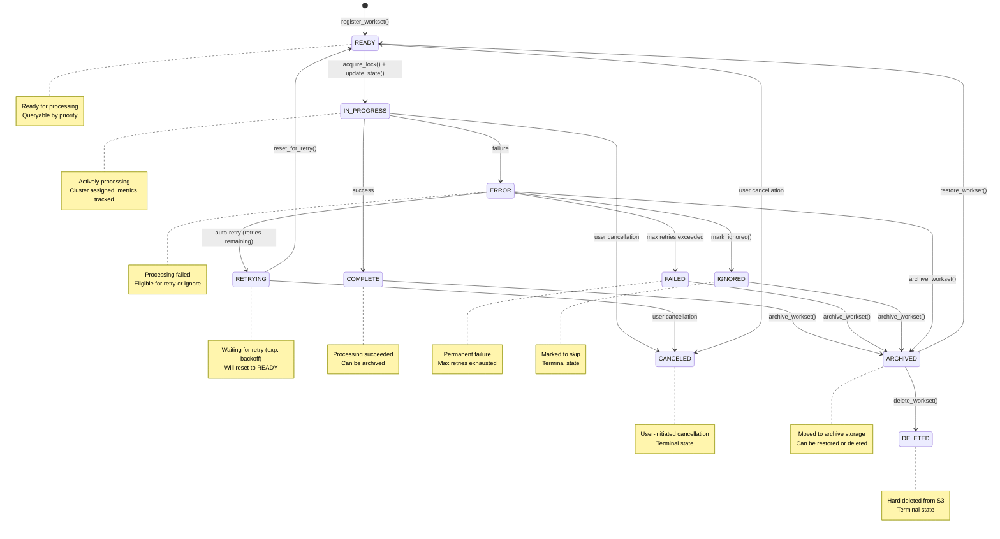
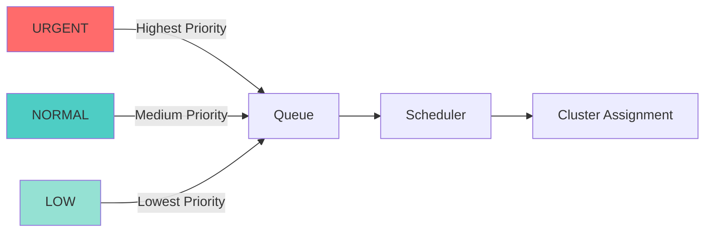
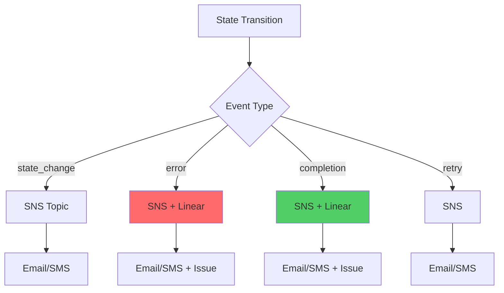

# Workset State Transition Diagram

This document visualizes the state transitions in the enhanced workset monitoring system.

## State Transition Flow


```mermaid
stateDiagram-v2
    [*] --> READY: register_workset()

    READY --> IN_PROGRESS: acquire_lock() + update_state()

    IN_PROGRESS --> COMPLETE: success
    IN_PROGRESS --> ERROR: failure
    IN_PROGRESS --> CANCELED: user cancellation

    ERROR --> RETRYING: auto‑retry (retries remaining)
    ERROR --> FAILED: max retries exceeded
    ERROR --> IGNORED: mark_ignored()

    RETRYING --> READY: reset_for_retry()
    RETRYING --> CANCELED: user cancellation

    READY --> CANCELED: user cancellation

    COMPLETE --> ARCHIVED: archive_workset()
    FAILED --> ARCHIVED: archive_workset()
    IGNORED --> ARCHIVED: archive_workset()
    ERROR --> ARCHIVED: archive_workset()

    ARCHIVED --> READY: restore_workset()
    ARCHIVED --> DELETED: delete_workset()

    note right of READY
        Ready for processing
        Queryable by priority
    end note

    note right of IN_PROGRESS
        Actively processing
        Cluster assigned, metrics tracked
    end note

    note right of ERROR
        Processing failed
        Eligible for retry or ignore
    end note

    note right of RETRYING
        Waiting for retry (exp. backoff)
        Will reset to READY
    end note

    note right of COMPLETE
        Processing succeeded
        Can be archived
    end note

    note right of FAILED
        Permanent failure
        Max retries exhausted
    end note

    note right of CANCELED
        User‑initiated cancellation
        Terminal state
    end note

    note right of IGNORED
        Marked to skip
        Terminal state
    end note

    note right of ARCHIVED
        Moved to archive storage
        Can be restored or deleted
    end note

    note right of DELETED
        Hard deleted from S3
        Terminal state
    end note
```

## State Descriptions

### READY
- **Description**: Workset is registered and ready for processing
- **Entry**: `register_workset()`, `reset_for_retry()`, or `restore_workset()`
- **Exit**: `acquire_lock()` + `update_state(IN_PROGRESS)`, or user cancellation
- **Queryable**: Yes, by priority (urgent > normal > low)

### IN_PROGRESS
- **Description**: Workset is actively being processed
- **Entry**: Lock acquired and state updated by monitor
- **Exit**: Success → COMPLETE, failure → ERROR, or user cancellation → CANCELED
- **Tracking**: Cluster name, metrics, progress substeps

### COMPLETE
- **Description**: Processing completed successfully
- **Entry**: Successful pipeline completion
- **Exit**: `archive_workset()` → ARCHIVED
- **Tracking**: Final metrics, cost, duration

### ERROR
- **Description**: Processing failed (may be retryable)
- **Entry**: Pipeline failure or error during IN_PROGRESS
- **Exit**: Auto-retry → RETRYING, max retries → FAILED, manual → IGNORED, or archive
- **Tracking**: Error details, error category, failed step

### RETRYING
- **Description**: Awaiting retry with exponential backoff
- **Entry**: `record_failure()` when retries remain (transient errors)
- **Exit**: `reset_for_retry()` → READY, or user cancellation → CANCELED
- **Backoff**: Exponential (base 2s, max 1 hour)
- **Config**: Default max retries = 3

### FAILED
- **Description**: Permanent failure after exhausting all retries
- **Entry**: `record_failure()` when max retries exceeded or permanent error
- **Exit**: `archive_workset()` → ARCHIVED
- **Terminal**: Yes (unless archived and restored)

### CANCELED
- **Description**: User-initiated cancellation
- **Entry**: `update_state(CANCELED)` from READY, IN_PROGRESS, or RETRYING
- **Exit**: None (terminal state)

### IGNORED
- **Description**: Workset marked to be skipped
- **Entry**: Manual intervention or policy decision from ERROR state
- **Exit**: `archive_workset()` → ARCHIVED
- **Terminal**: Yes (unless archived and restored)

### ARCHIVED
- **Description**: Moved to archive storage
- **Entry**: `archive_workset()` from COMPLETE, ERROR, FAILED, or IGNORED
- **Exit**: `restore_workset()` → READY, or `delete_workset()` → DELETED
- **Tracking**: Original state preserved, archival metadata

### DELETED
- **Description**: Hard deleted from S3 / DynamoDB
- **Entry**: `delete_workset()` from ARCHIVED (soft or hard delete)
- **Exit**: None (terminal state)
- **Note**: Hard delete removes the DynamoDB record entirely

## Priority Levels


```mermaid
graph LR
    A[URGENT] -->|Highest Priority| B[Queue]
    C[NORMAL] -->|Medium Priority| B
    D[LOW] -->|Lowest Priority| B
    B --> E[Scheduler]
    E --> F[Cluster Assignment]
    
    style A fill:#ff6b6b
    style C fill:#4ecdc4
    style D fill:#95e1d3
```

### Priority Behavior

- **URGENT**: Processed first, regardless of cost
- **NORMAL**: Processed by cost efficiency within normal priority
- **LOW**: Processed last, optimized for lowest cost

## Audit Trail

Every state transition is recorded in the `state_history` attribute:

```json
{
  "state_history": [
    {
      "timestamp": "2024-01-15T10:00:00Z",
      "state": "ready",
      "reason": "Workset registered"
    },
    {
      "timestamp": "2024-01-15T10:05:00Z",
      "state": "in_progress",
      "reason": "Pipeline started"
    },
    {
      "timestamp": "2024-01-15T12:30:00Z",
      "state": "error",
      "reason": "Network timeout",
      "error_category": "transient"
    },
    {
      "timestamp": "2024-01-15T12:30:01Z",
      "state": "retrying",
      "reason": "Retry 1/3 after transient error",
      "error_category": "transient"
    },
    {
      "timestamp": "2024-01-15T12:35:00Z",
      "state": "ready",
      "reason": "Reset for retry attempt"
    },
    {
      "timestamp": "2024-01-15T12:36:00Z",
      "state": "in_progress",
      "reason": "Pipeline restarted"
    },
    {
      "timestamp": "2024-01-15T14:00:00Z",
      "state": "complete",
      "reason": "Pipeline completed successfully"
    }
  ]
}
```

## Notification Events


```mermaid
graph TB
    A[State Transition] --> B{Event Type}
    B -->|state_change| C[SNS Topic]
    B -->|error| D[SNS + Linear]
    B -->|completion| E[SNS + Linear]
    B -->|retry| F[SNS]

    C --> G[Email/SMS]
    D --> H[Email/SMS + Issue]
    E --> I[Email/SMS + Issue]
    F --> J[Email/SMS]

    style D fill:#ff6b6b
    style E fill:#51cf66
```

## Best Practices

1. **Monitor queue depth** to detect backlogs
2. **Use priority wisely** — not everything is urgent
3. **Track metrics** for cost optimization
4. **Review ERROR and FAILED states** regularly
5. **Set up notifications** for critical events
6. **Archive completed worksets** to keep active tables lean
7. **Maintain audit trail** for compliance

## Troubleshooting

### Workset Stuck in RETRYING
- Check `retry_after` timestamp and backoff configuration
- Verify monitor is polling for retry-eligible worksets
- Consider canceling if the root cause is not transient

### High Queue Depth
- Check cluster availability
- Review priority distribution
- Consider adding more clusters

### Frequent Errors
- Review `error_category` (transient vs permanent)
- Check cluster configuration
- Verify input data quality

## Related Documentation

- [Quick Start Guide](./QUICKSTART_WORKSET_MONITOR.md)
- [Full Documentation](./WORKSET_MONITOR_ENHANCEMENTS.md)
- [Implementation Summary](../IMPLEMENTATION_SUMMARY.md)

