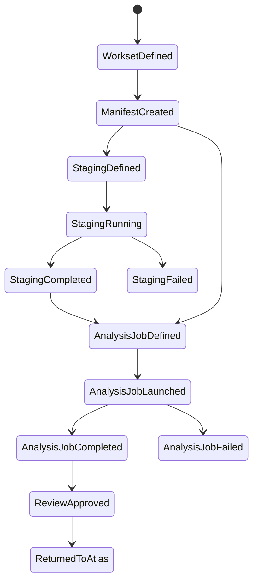

# Archived Background: Workset State Transition Diagram

This note is retained for historical workset-monitor context. Current Ursa state is broader than the older monitor state machine and is represented by resource records for worksets, manifests, staging jobs, analysis jobs, cluster jobs, linked buckets, user tokens, and analysis review/return.

Use the root [README](../README.md) and current tests as the source of truth for active behavior.

## Current High-Level Flow

```mermaid
stateDiagram-v2
    [*] --> WorksetDefined
    WorksetDefined --> ManifestCreated
    ManifestCreated --> StagingDefined
    StagingDefined --> StagingRunning
    StagingRunning --> StagingCompleted
    StagingRunning --> StagingFailed
    StagingCompleted --> AnalysisJobDefined
    ManifestCreated --> AnalysisJobDefined
    AnalysisJobDefined --> AnalysisJobLaunched
    AnalysisJobLaunched --> AnalysisJobCompleted
    AnalysisJobLaunched --> AnalysisJobFailed
    AnalysisJobCompleted --> ReviewApproved
    ReviewApproved --> ReturnedToAtlas
```

## Current Record Types

- Worksets group manifests and analysis state for a tenant.
- Manifests generate `metadata.analysis_samples_manifest` and downloadable `analysis_samples.tsv`.
- Staging jobs run `daylily-ec samples stage` and persist stage output plus logs.
- Analysis jobs launch or track execution using a manifest and, optionally, a completed staging job.
- Review approval gates Atlas return.

The older monitor states such as retrying, ignored, archived, and deleted may still be useful vocabulary for archived deployments, but they are not the active end-to-end Ursa API contract.
